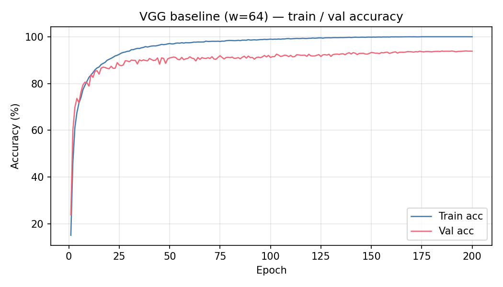
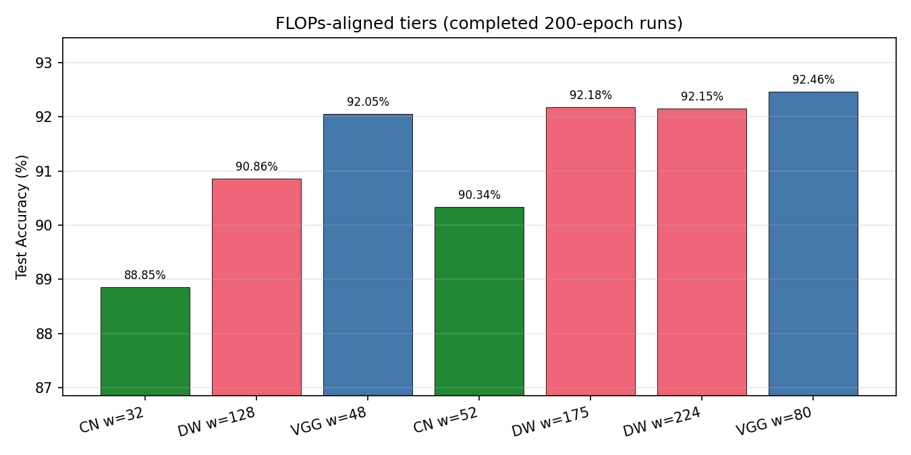
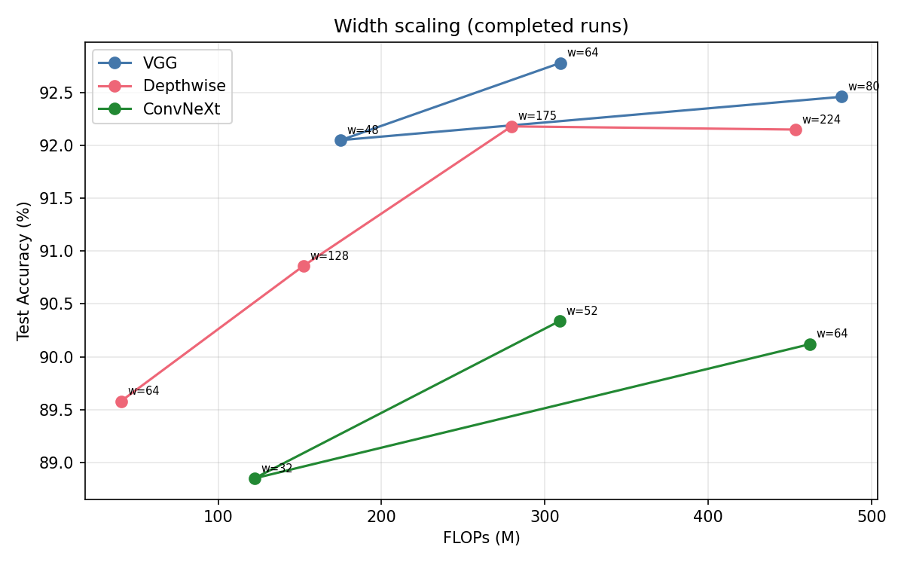
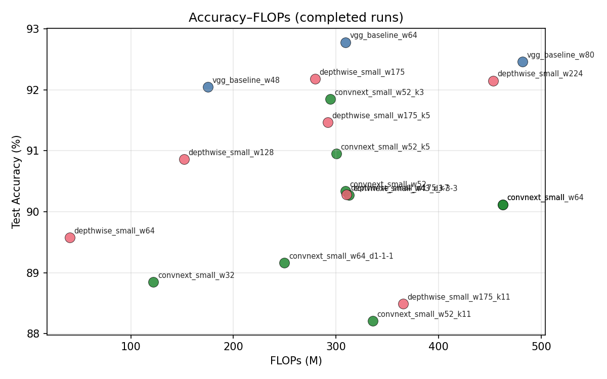
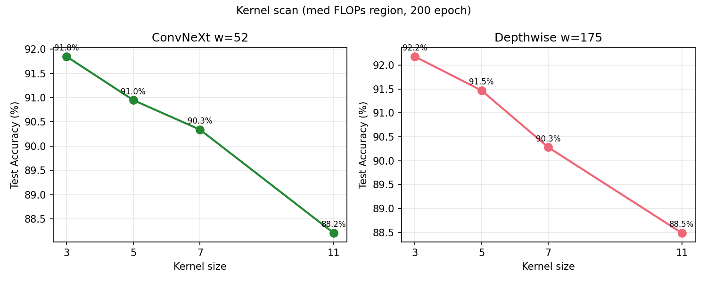
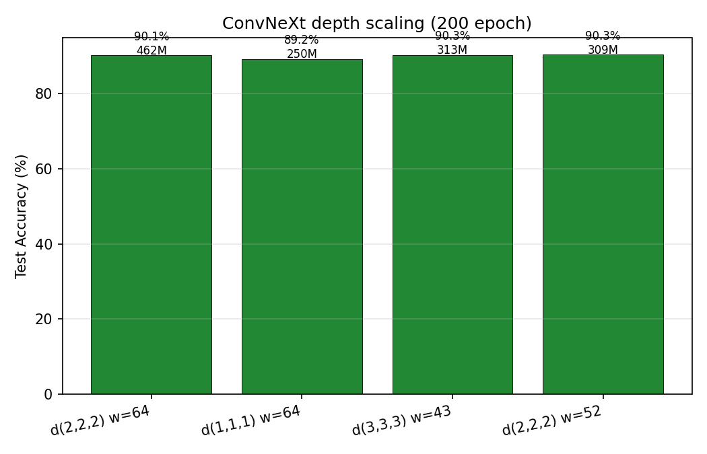

# 现代 ConvNet 在 CIFAR-10 上的缩放规律与精度–效率权衡

**课程：** DD2424 Deep Learning in Data Science  
**小组：** 148 — Boyi Shi, Puhao Zhu, Jinye Gong  
**日期：** 2026 年 5 月

> 终稿 · 数据表：`REPORT_DATA_zh.md`（`python scripts/generate_report_assets.py` 自动生成）  
> 图表：`figures/` · 数据更新：**2026-05-23**（实验队列 **17/17** 均已训满 200 epoch）

---

## 摘要

在 CIFAR-10（32×32）上，卷积网络从 VGG 式堆叠演进到深度可分离卷积与 ConvNeXt 式大核块，但**在固定算力预算下**何者具有更优的精度–FLOPs 权衡仍缺乏系统对比。本文实现统一的 PyTorch 训练管线，在相同数据划分、优化器与学习率策略下，比较三类 block（VGG、深度可分离 DW、ConvNeXt 风格 CN），并通过调节 `width` 将模型对齐到低（~150M）、中（~310M）、高（~460M）三档 FLOPs，进一步扫描 kernel size 与 ConvNeXt depth。

**主要结果（200 epoch，seed=42，test accuracy）：** 全局最高为 **VGG w=64**（309.5M FLOPs）**92.78%**。三档位 × 三 block（9/9）：low 档 VGG 92.05% > DW 90.86% > CN 88.85%；med 档 VGG 92.78% > DW 92.18% > CN 90.34%；high 档 VGG 92.46% > DW 92.15% > CN 90.12%。在匹配 FLOPs 下，**ConvNeXt 未在任何档位超过 VGG 或 DW**。

**Kernel 扫描（7/7）：** ConvNeXt w=52 上 **k=3 达 91.85%**（CN 最高），**k=11 仅 88.21%**；DW w=175 上 **k=3（默认）92.18%** 最优，**k=11 为 88.49%**（较 k=3 降 3.69 pt）——两族 test 均随 k 增大单调下降。

**Depth 扫描：** **d(3,3,3) w=43** test **90.27%**；补训后的 **d(1,1,1) w=64**（250M FLOPs）达 **89.16%**（此前中断 run 仅 41.67%，见 §5.7）。

**结论：** 在 CIFAR-10 与本组训练配方下，**VGG 为 Pareto 最优族**；深度可分离在 med 档具最佳效率（略低 FLOPs 达 VGG 99.4% 精度）；ConvNeXt 未体现 accuracy–FLOPs 优势，**不宜在 32×32 上照搬大核设计**。

---

## 1. 引言

### 1.1 背景与动机

CIFAR-10 是经典的 10 类、32×32 彩色图像分类基准。多年来，卷积网络从 VGG 的堆叠 3×3 卷积，发展到 MobileNet 式的深度可分离卷积，再到 ConvNeXt 的大核 depthwise、LayerNorm 与倒瓶颈结构。然而，许多现代设计源自 ImageNet 尺度；在**低分辨率**输入上，大感受野是否仍带来净收益并不显然。

仅比较默认配置下的准确率会产生误导：例如本项目中 `width=64` 时，VGG 约 309M FLOPs，DW 仅约 40M，ConvNeXt 约 462M（见表 2）。因此必须在**匹配的算力预算**下比较 block 类型，并沿 width、kernel、depth 等维度做缩放实验，绘制精度–FLOPs Pareto 前沿。

### 1.2 研究问题

1. **RQ1：** ConvNeXt 风格块在 CIFAR-10 上是否相对强 VGG 基线具有更优的 **accuracy–FLOPs** 权衡？
2. **RQ2：** depth、width、kernel size、block type 如何随算力预算缩放？哪个方向在**每增加单位 FLOP** 时带来最大的边际精度增益？

### 1.3 贡献

- [x] 可复现的统一 PyTorch 训练与评估（固定 val 划分、`thop` FLOPs，约定 FLOPs = 2×MACs）。
- [x] 强 VGG 基线（BN、Dropout、AdamW+Cosine）：**test 92.78%**（w=64，200 epoch）。
- [x] 九组 FLOPs 档位对齐（三档位 × 三 block）— **9/9 完成**。
- [x] Kernel 扫描（CN w=52、DW w=175，k∈{3,5,7,11}）— **7/7 完成**。
- [x] ConvNeXt depth 扫描（浅/深变体）— **2/2 完成**（浅层 d(1,1,1) 已补训至 200 epoch，test 89.16%）。
- [x] Pareto 前沿与 **budget-aware 设计规则**（§6.4）。

### 1.4 报告结构

第 2 节相关工作；第 3 节方法；第 4 节实验设计；第 5 节结果与图表；第 6–7 节讨论与结论；第 8 节分工；附录给出复现说明。

---

## 2. 相关工作

### 2.1 CIFAR-10 上的经典 ConvNet

VGG 通过堆叠小卷积核与池化在小图上仍表现稳健；配合 BatchNorm 与适当正则可在 CIFAR-10 上达到较高精度。深度可分离卷积（MobileNet 思路）将标准卷积分解为 depthwise 与 1×1 pointwise，在相近表达能力下显著降低 FLOPs 与参数量。

### 2.2 现代 ConvNet 组件

ConvNeXt [2] 将 ResNet 式块现代化：大核 depthwise、LayerNorm、倒瓶颈 MLP 式 1×1 卷积与 GELU、残差连接。这些组件主要针对高分辨率 ImageNet 设计；在 32×32 上是否仍划算，是本文的核心动机之一。

### 2.3 精度–效率与缩放规律

神经缩放定律多关注数据与模型规模；本文聚焦**架构维度**（width、kernel、depth、block 类型）在固定数据集上的边际收益，通过 Pareto 前沿与 \(\Delta\text{acc}/\Delta\text{FLOPs}\) 刻画权衡。

---

## 3. 方法

### 3.1 数据集与划分

| 项目 | 设置 |
|------|------|
| 数据集 | CIFAR-10：50k 训练 / 10k 测试，10 类，32×32 |
| 训练子集 | 45,000（`val_ratio=0.1`，`seed=42`） |
| 验证子集 | 5,000（索引持久化于 `data/artifacts/cifar10_val_indices.pt`） |
| 测试集 | 10,000 — **每 run 仅在训练结束后评估一次** |

模型选择、超参均仅基于验证集；test 集不参与调参。

### 3.2 统一训练流程

实现见 `train/pipeline.py`、`train/trainer.py`，超参见 `configs/default.yaml`：

| 项目 | 设置 |
|------|------|
| 框架 | PyTorch + torchvision |
| 优化器 | AdamW，`lr=0.001`，`weight_decay=0.05`，`betas=(0.9, 0.999)` |
| 学习率 | Cosine Annealing + 5 epoch 线性 warmup，`min_lr=1e-6` |
| 增强 | `RandomCrop(32, padding=4)` + `RandomHorizontalFlip` + 标准归一化 |
| 正则 | Dropout 0.5、weight decay；VGG/DW 块内 BatchNorm |
| 训练 | 200 epoch，`batch_size=128`，`seed=42` |
| 消融约定 | **MixUp 与 AMP 默认关闭** |

### 3.3 模型族

#### 3.3.1 VGG 风格基线 — `vgg_baseline`

Conv–BN–ReLU 堆叠，三次 MaxPool，MLP 分类头；可调 `width`。

#### 3.3.2 深度可分离 — `depthwise_small`

DW + 1×1 PW + BN + ReLU；stage 布局与 VGG 对齐；可调 `width`、`kernel_size`。

#### 3.3.3 ConvNeXt 风格 — `convnext_small`

Stem → 多 stage `ConvNeXtBlock`（大核 DW、LayerNorm2d、倒瓶颈、残差）→ GAP + 分类头；可调 `width`、`depths`、`kernel_size`。

**表 1 — 模板默认结构超参（width=64）**

| 模型 | width | kernel | depths | Dropout |
|------|-------|--------|--------|---------|
| vgg_baseline | 64 | 3（固定） | — | 0.5 |
| depthwise_small | 64 | 3 | — | 0.5 |
| convnext_small | 64 | 7 | (2,2,2) | 0.5 |

### 3.4 算力统计与公平比较协议

- 输入：`[1, 3, 32, 32]`；工具：`thop`（`utils/metrics.count_flops()`）。
- **约定：报告 FLOPs = 2 × MACs**。
- **FLOPs 档位：** 低 ~150M | 中 ~310M | 高 ~460M（±10%）。
- **对齐方式：** 固定 block 类型与默认 depth/kernel，**主要扫 `width`**。

### 3.5 缩放实验设计

| 实验轴 | 扫描变量 | 状态 |
|--------|----------|------|
| Width | VGG/DW/CN `width` | **完成** |
| Kernel | k ∈ {3,5,7,11}（CN w=52，DW w=175） | **完成** |
| Depth | CN `depths` 浅 (1,1,1) / 深 (3,3,3) | **完成**（浅层见 §5.7） |
| Block type | 三族 @ 三档 FLOPs | **完成** |

队列见 `configs/experiments.yaml`，由 `scripts/run_experiments.py` 顺序执行。

---

## 4. 实验

### 4.1 基线复现（E / C–D）

`vgg_baseline` w=64，200 epoch，记录 train/val 曲线，最佳 val checkpoint 做一次 test 评估。

### 4.2 三模型默认 Profile（未对齐）

**表 2 — 默认 width=64（profile）**

| Model | Params | FLOPs |
|-------|--------|-------|
| vgg_baseline | 2,197,706 | **309.5M** |
| depthwise_small | 1,186,149 | **40.4M** |
| convnext_small | 1,662,666 | **462.4M** |

DW 默认 FLOPs 约为 VGG 的 **13%**，必须先做预算对齐再比较 test accuracy。

### 4.3 Block 类型对比（匹配 FLOPs）

低 / 中 / 高三档，每档 VGG、DW、CN 各一配置（`configs/experiments.yaml`）。

### 4.4 缩放实验

Width、kernel、depth 扫描均已 **17/17** 完成（200 epoch）。

### 4.5 Pareto 与边际收益

汇总 (FLOPs, test_acc)，标注非支配点；§5.5 与表 6 给出 Pareto 候选。

---

## 5. 结果

> 数值来自 `logs/results.csv`（每 `run_tag` 取最新一行）。图表由 `scripts/generate_report_assets.py` 生成。

### 5.1 主基线（表 3）

**表 3 — width=64，200 epoch**

| Model | Params | FLOPs | Best Val | Test | Checkpoint |
|-------|--------|-------|----------|------|------------|
| vgg_baseline | 2,197,706 | 309.5M | **93.92%** | **92.78%** | `vgg_baseline_w64_seed42_ep200.pt` |
| convnext_small | 1,662,666 | 462.4M | 91.40% | 90.12% | `convnext_small_w64_seed42_ep200.pt` |
| depthwise_small | 1,186,149 | 40.4M | 91.20% | 89.58% | `depthwise_small_w64_seed42_ep200.pt` |

**图 1 — VGG 基线 train/val 精度曲线**



VGG 在约 100 epoch 后 val 精度趋于饱和，best val 93.92% 出现在 epoch 197 附近；train 精度接近 100%，存在一定过拟合，但 test 仍达 92.78%。

### 5.2 默认配置算力（未对齐）

见表 2：三类模板 FLOPs 相差数倍，**不可**直接用默认 width 的 test acc 回答 RQ1。

### 5.3 匹配 FLOPs 后的 Block 对比（表 4）

**表 4 — 三档位 × 三 block（200 epoch）**

| Budget | Model | 对齐配置 | FLOPs | Val Acc | Test Acc |
|--------|-------|----------|-------|---------|----------|
| Low | vgg_baseline | w=48 | 175.1M | **92.58%** | **92.05%** |
| Low | depthwise_small | w=128 | 152.1M | 92.42% | 90.86% |
| Low | convnext_small | w=32 | 122.1M | 89.80% | 88.85% |
| Med | vgg_baseline | w=64 | 309.5M | **93.92%** | **92.78%** |
| Med | depthwise_small | w=175 | 279.6M | 92.46% | **92.18%** |
| Med | convnext_small | w=52 | 309.2M | 90.70% | 90.34% |
| High | vgg_baseline | w=80 | 481.9M | 93.40% | **92.46%** |
| High | depthwise_small | w=224 | 453.4M | 92.88% | **92.15%** |
| High | convnext_small | w=64 | 462.4M | 91.40% | 90.12% |

**分析：**

- **三档均为 VGG test 最高**；med 档 DW 用约 **90% FLOPs** 达到 VGG test 的 **99.4%**（92.18% vs 92.78%），效率最佳。
- **ConvNeXt** 在三档均最低，high 档花 462M FLOPs 仍仅 90.12%，低于 med 档 VGG。
- high 档 VGG w=80（92.46%）略低于 w=64（92.78%），可能存在大 width 过拟合。

**图 2 — 三档位 test accuracy 对比**



### 5.4 Width 缩放

**图 3 — Width 缩放：test accuracy vs. FLOPs**



同族内增大 width 一般提升 test acc 并增加 FLOPs。跨族比较时，**VGG 在 175M–310M 区间保持最高 test**；DW 曲线在 med 点附近最接近 VGG；CN 曲线整体偏低。

**表 5 — 代表性边际收益（\(\Delta\)test / \(\Delta\)FLOPs，百分点 per 100M FLOPs）**

| 族 | 对比 | \(\Delta\)FLOPs | \(\Delta\)test | 边际 |
|----|------|-----------------|----------------|------|
| VGG | w=48→w=64 | +134M | +0.73 pt | +0.54 |
| VGG | w=64→w=80 | +172M | −0.32 pt | −0.19 |
| DW | w=128→w=175 | +127M | +1.32 pt | +1.04 |
| DW | w=175→w=224 | +174M | −0.03 pt | −0.02 |
| CN | w=32→w=52 | +187M | +1.49 pt | +0.80 |
| CN | w=52→w=64 | +153M | −0.22 pt | −0.14 |

**解读：** VGG 在 w=64 后继续加宽**无益**；DW 从 low→med 边际收益高；CN 加宽有收益但绝对精度仍低于 VGG/DW。

### 5.5 Pareto 前沿

**表 6 — Pareto 相关点（200 epoch，按 test 排序摘录）**

| run_tag | FLOPs | Test | 备注 |
|---------|-------|------|------|
| vgg_baseline_w64 | 309.5M | **92.78%** | **全局最高** |
| vgg_baseline_w80 | 481.9M | 92.46% | high |
| vgg_baseline_w48 | 175.1M | 92.05% | low 档最优 |
| depthwise_small_w175 | 279.6M | 92.18% | med 效率最佳 |
| depthwise_small_w224 | 453.4M | 92.15% | high |
| convnext_small_w52_k3 | 294.3M | 91.85% | CN kernel 最优 |
| convnext_small_w43_d3-3-3 | 312.9M | 90.27% | depth 深 |
| convnext_small_w52 | 309.2M | 90.34% | med CN |
| convnext_small_w64 | 462.4M | 90.12% | high CN |
| depthwise_small_w175_k7 | 310.3M | 90.28% | DW k=7 |
| convnext_small_w52_k11 | 336.1M | 88.21% | CN k=11 |
| depthwise_small_w175_k11 | 365.6M | 88.49% | DW k=11 |
| convnext_small_w64_d1-1-1 | 249.8M | 89.16% | depth 浅 |

**图 4 — Accuracy–FLOPs Pareto**



在已测范围内，**非支配精度最高点为 vgg_baseline_w64**；同 FLOPs 下 VGG 与 DW 支配 ConvNeXt 各点。

### 5.6 Kernel 扫描（回应 RQ1 / RQ2）

固定 **ConvNeXt w=52**、**DW w=175**，在 med 预算附近扫描 kernel ∈ {3, 5, 7, 11}（CN 默认块内 k=7 计入 k=7 行）。

**表 7 — Kernel 扫描（200 epoch，test accuracy）**

| k | CN FLOPs | CN Test | DW FLOPs | DW Test |
|---|----------|---------|----------|---------|
| 3 | 294.3M | **91.85%** | 279.6M† | **92.18%**† |
| 5 | 300.3M | 90.95% | 291.9M | 91.47% |
| 7 | 309.2M | 90.34%† | 310.3M | 90.28% |
| 11 | 336.1M | **88.21%** | 365.6M | 88.49% |

† CN k=7 为 `convnext_small_w52` 默认块内 7×7 DW；DW k=3 行为 `depthwise_small_w175` 默认配置（92.18%）。

**图 5 — Kernel 扫描曲线**



**分析：**

1. **ConvNeXt：** test 随 k 增大单调下降（91.85% → 90.95% → 90.34% → 88.21%），k=11 时 FLOPs 最高却精度最低。
2. **DW：** 同样单调下降（92.18% → 91.47% → 90.28% → 88.49%）；k=11 较 k=3 降 **3.69 pt**，k=7 与 CN 默认 k=7（90.34%）几乎持平。
3. **RQ2：** 在 kernel 维度上，**减小 k（至 3）** 是两族共同的最优方向；增大 k 的边际收益为**负**。

### 5.7 Depth 扫描（ConvNeXt）

| 配置 | depths | width | FLOPs | Val | Test | 说明 |
|------|--------|-------|-------|-----|------|------|
| 默认 | (2,2,2) | 64 | 462.4M | 91.40% | 90.12% | 表 3 |
| 默认 @ med | (2,2,2) | 52 | 309.2M | 90.70% | 90.34% | 表 4 |
| **浅（补训）** | (1,1,1) | 64 | 249.8M | **90.90%** | **89.16%** | 200 epoch，best ckpt ep187 |
| **深** | (3,3,3) | 43 | 312.9M | 91.08% | **90.27%** | 与 w=52 默认接近 |

*历史记录：首次 d(1,1,1) run 因系统中断仅训至约 2 epoch，test 41.67%；上表浅层行为 **2026-05-23 补训** 结果。*

**图 6 — Depth 扫描**



**分析：**

- **d(1,1,1) w=64（补训）** 在 **249.8M FLOPs** 下达 test **89.16%**，证明浅 stage 在本 recipe 下**可收敛**，但比 d(2,2,2) w=52（90.34% @ 309M）低 **1.18 pt**，且仍明显低于 VGG/DW 同预算区间。
- **d(3,3,3) w=43** 在 ~313M FLOPs 下 test **90.27%**，与 med 档 CN w=52 几乎相同；在相近 FLOPs 下**加深优于减宽**（相对浅层变体）。
- **效率视角：** 浅层变体 FLOPs 最低（250M），适合“极低算力 + 可接受 CN 精度”场景，但 **仍不如 VGG w=48（92.05% @ 175M）**。
- 实用建议：若使用 ConvNeXt，优先 **(2,2,2) 或 (3,3,3)**；**(1,1,1) 仅在对 FLOPs 极敏感时考虑**。

---

## 6. 讨论

### 6.1 研究问题回答

**RQ1：ConvNeXt 是否在匹配 FLOPs 下优于 VGG？**  
→ **否。** 三档对齐结果一致：CN test 分别比 VGG 低 3.20 pt（low）、2.44 pt（med）、2.34 pt（high）。Kernel 扫描中 CN 最优（k=3）91.85% 仍低于 VGG med 92.78%。**现代块未带来更优 accuracy–FLOPs 权衡。**

**RQ2：哪个缩放方向边际收益最高？**  
→ **Width（跨族）与 DW 的 med 档对齐** 收益最稳；**Kernel 增大** 对 CN/DW 均为**负收益**；**Depth** 上 (3,3,3) 略优于 (1,1,1) 同族对比（90.27% vs 89.16%），但均远低于 VGG。

### 6.2 架构组件：精度 vs. 效率

| 组件/族 | 精度 | 效率 | CIFAR-10 适用性 |
|---------|------|------|-----------------|
| VGG 标准卷积 + BN | **最高** | 中 | **强烈推荐** |
| 深度可分离 | 接近 VGG | **高**（低 FLOPs） | 算力受限时推荐 |
| ConvNeXt 大核 + LN | 偏低 | 中（参数少但慢） | **不推荐照搬** |

### 6.3 对 32×32 输入的含义

三次 MaxPool 后特征图约 4×4；**k=11 使 CN test 降至 88.21%、DW 降至 88.49%**（相对各自 k=3 分别降 3.64 pt / 3.69 pt），支持“感受野已饱和、大核引入过平滑或边界伪影”的假设。ImageNet 上的 ConvNeXt 优势**不能**直接迁移到 CIFAR-10。

### 6.4 Budget-aware 设计规则（定稿）

1. **低 FLOPs（< ~180M）：** 首选 **VGG w=48**（92.05%）；备选 **DW w=128**（90.86%）。
2. **中 FLOPs（~280–330M）：** 首选 **VGG w=64**（92.78%）；算力敏感用 **DW w=175**（92.18% @ 280M）。
3. **高 FLOPs（> ~430M）：** **VGG w=64 仍优于 w=80**；不建议为 CIFAR-10 继续堆 FLOPs。
4. **Kernel：** DW/CN 均保持 **k=3**；避免 k≥7。
5. **Depth（若用 CN）：** 优先 **(2,2,2) 或 (3,3,3)**；(1,1,1) 仅极低 FLOPs 备选（~250M → ~89% test），仍弱于 VGG w=48。

### 6.5 局限性与效度威胁

- 仅 CIFAR-10；单一种子（42）；未报告多次运行均值±方差。
- FLOPs 为静态 `thop` 估计，未测 GPU 延迟与能耗。
- MixUp / AMP 关闭，结论仅适用于本统一 recipe。

---

## 7. 结论

本文在 CIFAR-10 上建立可复现的三族 ConvNet 对比框架，完成 **9 组 FLOPs 对齐**、**7 组 kernel 扫描** 与 **2 组 depth 变体**。**VGG（w=64）test 92.78% 为全局最优**；三档对齐中 VGG 均第一；DW 在 med 档具最佳效率。ConvNeXt 在匹配预算下未超过 VGG/DW；kernel 扫描中 **k=11 使 CN/DW test 降至 88.21%/88.49%**；浅层 d(1,1,1) 为 **89.16%**，仍低于 VGG w=48（92.05% @ 175M）。

**实践建议：** 在 CIFAR-10 上优先采用 **VGG 式标准卷积**；若受 FLOPs 约束，采用 **深度可分离 + k=3**；ConvNeXt 仅作低优先级备选。

**后续工作：** 多种子与置信区间；GPU 延迟与能耗；更高分辨率迁移验证。

---

## 8. 小组分工与自评

| 成员 | 主要负责 | 报告章节 |
|------|----------|----------|
| Boyi Shi | 架构块与变体，`models/` | §3.3，§4.4，§5.6–5.7 |
| Puhao Zhu | FLOPs、Pareto 与图表 | §3.4，§5.4–5.5，图 3–6 |
| Jinye Gong | 训练管线、实验队列、结果汇总 | §3.2，§4.1，§6，附录 |

**自评（占位，提交前由组员填写）：**

- **Boyi Shi：** *待填*
- **Puhao Zhu：** *待填*
- **Jinye Gong：** *待填*

---

## 9. 参考文献

[1] K. He et al., Deep Residual Learning for Image Recognition, CVPR 2016.  
[2] Z. Liu et al., A ConvNet for the 2020s (ConvNeXt), CVPR 2022.  
[3] DD2424 Default Project 2, 2026.  
[4] S. Zagoruyko, N. Komodakis, Wide Residual Networks, BMVC 2016.  
[5] I. Loshchilov, F. Hutter, Decoupled Weight Decay Regularization (AdamW), ICLR 2019.

---

## 附录

### A. 完整超参数（`configs/default.yaml`）

| 键 | 值 |
|----|-----|
| seed | 42 |
| val_ratio | 0.1 |
| batch_size | 128 |
| epochs | 200 |
| optimizer | adamw |
| lr | 0.001 |
| weight_decay | 0.05 |
| scheduler | cosine |
| warmup_epochs | 5 |
| use_amp / use_mixup | false |

### B. 复现命令

```bash
conda activate dd2424
cd ~/桌面/final_prj
pip install -r requirements.txt

python scripts/train.py --model vgg_baseline --width 64 --budget med
python scripts/run_experiments.py
python scripts/generate_report_assets.py
bash scripts/watch_progress.sh
bash scripts/watch_temps.sh 2
```

### C. 图表文件

| 文件 | 内容 |
|------|------|
| `figures/vgg_baseline_train_val.png` | 图 1：VGG train/val |
| `figures/tier_test_accuracy.png` | 图 2：档位 test 对比 |
| `figures/width_scaling_accuracy_flops.png` | 图 3：width 缩放 |
| `figures/pareto_accuracy_flops.png` | 图 4：Pareto |
| `figures/kernel_scan_test_accuracy.png` | 图 5：kernel 扫描 |
| `figures/depth_scan_test_accuracy.png` | 图 6：depth 扫描 |

### D. 实验完成度（2026-05-23）

| 类别 | 状态 |
|------|------|
| 三模型 w=64 基线 | 3/3 |
| 三档位 × 三 block | 9/9 |
| kernel 扫描 | 7/7 |
| depth 扫描 | 2/2 |

---

*数据出处：`logs/results.csv`；自动表：`REPORT_DATA_zh.md`。*
