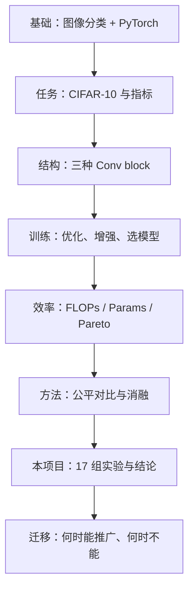

# 掌握本实验：计算机视觉本科生学习指南

**项目：** 现代 ConvNet 在 CIFAR-10 上的缩放规律与精度–效率权衡  
**小组 148：** Boyi Shi · Puhao Zhu · Jinye Gong · DD2424  
**用途：** 系统掌握实验所需的背景知识、方法、结论与自测；面向**全体组员**与答辩准备，不限于单人分工。

**相关文档：** `REPORT_zh.md` · `PPT_QA_bilingual.md` · `PPT_SCRIPT_zh.md` · `configs/default.yaml`

---

## 知识地图总览

---

## 第一层：深度学习与 CV 基础

### 1.1 图像分类任务

- **输入：** 张量 `[N, C, H, W]`；CIFAR-10 为 **3×32×32**，10 类。
- **输出：** 每类一个 logit；**交叉熵损失** + **softmax**。
- **指标：** **Top-1 accuracy**（test / val）；须分清 **val 用于调参与选模型，test 仅在训练结束后评估一次**。

### 1.2 卷积神经网络核心算子

| 概念 | 要理解什么 |
|------|------------|
| **标准卷积** | 在空间上同时混合「通道」；参数量约 \(C_{in} \times C_{out} \times k^2\)。 |
| **Depthwise 卷积** | `groups=in_ch`，每个通道单独卷积，**不混通道**。 |
| **Pointwise (1×1)** | 在 DW 之后做通道混合；合起来为 **深度可分离卷积**（MobileNet 思路）。 |
| **池化** | MaxPool ÷2：空间尺寸减半；本网络 **3 次池化** → \(32 \to 16 \to 8 \to 4\)。 |
| **感受野** | 越深、核越大，每个像素「看到」的原图区域越大；**小特征图上大核易无收益甚至有害**。 |

### 1.3 正则与归一化

- **BatchNorm：** 按 batch 统计归一化；VGG / DW 使用。
- **LayerNorm：** 按通道/特征归一化；ConvNeXt 块使用（与 BN **不是**简单等价替换）。
- **Dropout、Weight decay：** 减轻过拟合；VGG test 92.78% 时 train 接近 100%，存在轻度过拟合但仍可接受。

### 1.4 PyTorch 训练循环

- `Dataset` / `DataLoader`、前向、`loss.backward()`、`optimizer.step()`。
- **Checkpoint：** 按 **val acc** 保存最好模型，而非最后一 epoch。
- **固定 seed（42）** 保证划分与初始化可复现。

**代码位置：** `train/pipeline.py`、`train/trainer.py`

---

## 第二层：CIFAR-10 与实验惯例

### 2.1 为什么常用 CIFAR-10

- 小图、训练快，适合**架构对比**与课程项目。
- **局限：** 结论主要适用于 **低分辨率**；不能直接推广到 ImageNet 尺度。

### 2.2 数据划分（本项目）

| 集合 | 规模 | 说明 |
|------|------|------|
| 训练 | 45,000 | 从官方 50k 中划分，`val_ratio=0.1` |
| 验证 | 5,000 | 索引固定于 `data/artifacts/cifar10_val_indices.pt`，seed=42 |
| 测试 | 10,000 | **不参与**调参、选 checkpoint |

**增强：** `RandomCrop(32, padding=4)` + 水平翻转 + CIFAR 标准 mean/std。

### 2.3 现代训练配方

- **AdamW**（解耦 weight decay）+ **Cosine 学习率** + **5 epoch warmup**。
- **MixUp / CutMix / AMP：** 能提分，但会改变「只比结构」的语义 → 主实验**统一关闭**（见 `configs/default.yaml`）。

---

## 第三层：三种架构（实验核心对象）

### 3.1 VGG 风格 — `models/vgg_baseline.py`

- **Conv–BN–ReLU** 堆叠，3 个 stage，每 stage 2 个 conv + MaxPool。
- 分类头：Flatten → Linear → Dropout → Linear。
- **`width`：** 通道基数，控制容量与 FLOPs。

**尺寸推导：** 3 次池化后特征图 **4×4**，通道约 `4×width` → 全连接输入维 `4 × width × 4 × 4`。

### 3.2 深度可分离 — `models/depthwise.py`

- 一个 block = **DW conv（groups=channels）+ 1×1 PW conv** + BN + ReLU。
- **与 VGG 相同的 stage 布局** → 公平比较 **block 类型**。
- 可调 **`width`**、**`kernel_size`**。

**直觉：** 同 width 下 FLOPs 远低于 VGG；须在 **匹配 FLOPs** 后再比 test acc。

### 3.3 ConvNeXt 风格 — `models/convnext_style.py`

- Block：**大核 depthwise → LayerNorm → 1×1 扩通道 → GELU → 1×1 压回** + 残差。
- 默认 **k=7**，depths **(2,2,2)**。
- 可调 **`width`**、**`kernel_size`**、**`depths`**。

**文献动机：** 大核捕获长程依赖；倒瓶颈类似 Transformer FFN；LN + 残差稳定训练。

**本项目结论：** 在 32×32、4×4 特征图上，**大核不带来 ImageNet 上的收益**。

### 3.4 默认 width=64 时的 Profile（未对齐，不能答 RQ1）

| 模型 | Params | FLOPs |
|------|--------|-------|
| vgg_baseline | 2,197,706 | **309.5M** |
| depthwise_small | 1,186,149 | **40.4M** |
| convnext_small | 1,662,666 | **462.4M** |

DW 默认 FLOPs 约为 VGG 的 **13%**。

---

## 第四层：算力、参数与公平对比

### 4.1 Params vs FLOPs vs 延迟

| 指标 | 含义 | 本项目 |
|------|------|--------|
| **参数量** | 权重个数 | 辅助分析；**不能单独决定谁更好** |
| **FLOPs** | 前向浮点运算次数（静态） | **主对比轴**；`thop` + `utils/metrics.count_flops()` |
| **GPU 延迟** | 真实推理快慢 | **未测** |

### 4.2 MACs 与 FLOPs

- 1 MAC = 1 乘 + 1 加 → **FLOPs = 2 × MACs**（`thop` 输出 MAC 时需换算）。

### 4.3 匹配 FLOPs 三档

| 档位 | 目标 FLOPs |
|------|------------|
| Low | ~150M |
| Med | ~310M |
| High | ~460M |

**对齐方式：** 固定 block 类型与默认 depth/kernel，**主要调节 `width`**（±10% 容差）。

### 4.4 Pareto 前沿

- 每点 = 一次完整训练 (FLOPs, test acc)。
- **非支配点：** 不存在更省 FLOPs 且更高精度的另一点。
- **结果：** 上包络为 **VGG + DW**；ConvNeXt 各点均被支配。

### 4.5 边际收益

- 概念：\(\Delta \text{acc} / \Delta \text{FLOPs}\)。
- **VGG w=64→80：** 精度**下降**（92.78% → 92.46%）。
- **Kernel k 增大：** CN / DW test **单调下降**。

---

## 第五层：实验方法论

### 5.1 研究问题

| RQ | 问题 | 答案（本项目） |
|----|------|----------------|
| **RQ1** | 匹配 FLOPs 下，ConvNeXt 是否优于强 VGG？ | **否。** 三档 VGG test 均为第一；CN 低约 2–3 pt。 |
| **RQ2** | width / kernel / depth / block 谁边际收益最高？ | **Block：** VGG > DW > CN；**Width** 有效但饱和；**Kernel 增大为负收益**；**Depth** 对 CN 有限。 |

### 5.2 消融设计

| 消融 | 控制变量 | 回答什么 |
|------|----------|----------|
| 三档 × 三 block（9 组） | block @ 固定 FLOPs | RQ1 |
| Width 扫描 | 同族内加宽 | 饱和、边际收益 |
| Kernel 扫描 k∈{3,5,7,11} | 固定 CN w=52、DW w=175 | 大核是否负收益 |
| Depth (1,1,1) vs (3,3,3) | CN 深浅 | 加深是否值得 |

### 5.3 实验规模与配方

- **17/17** 组，各 **200 epoch**，seed **42**。
- 统一 `configs/default.yaml`；队列 `configs/experiments.yaml`；`scripts/run_experiments.py` 顺序执行。
- 结果写入 `logs/results.csv`；图表由 `scripts/generate_report_assets.py` 生成。

### 5.4 效度威胁（局限）

- 仅 CIFAR-10；单 seed；静态 FLOPs（无延迟/能耗）。
- MixUp/AMP 关闭 → 结论适用于**本组统一 recipe**。
- CN 浅层 (1,1,1) 曾中断，已补训至 200 epoch（报告用补训结果）。

---

## 第六层：本项目结论（数字 + 机制）

### 6.1 必记结果

| 项目 | 数值 |
|------|------|
| 全局最优 | **vgg_baseline w=64**：309.5M FLOPs，**test 92.78%**（val 93.92%） |
| 低档 test (VGG / DW / CN) | **92.05%** / 90.86% / 88.85% |
| 中档 test | **92.78%** / 92.18% / 90.34% |
| 高档 test | **92.46%** / 92.15% / 90.12% |
| DW 中档效率 | ~**90%** FLOPs，达 VGG **99.4%** 精度 |
| DW kernel k=3→11 | 92.18% → 88.49%（约 **-3.69 pt**） |
| VGG w=64→w=80 | 92.78% → 92.46%（**更差**） |
| CN 最佳（kernel） | k=3, w=52：**91.85%**（仍低于 VGG med） |

### 6.2 机制：为何 ConvNeXt 在小图输？

1. 输入 32×32，**3 次 MaxPool** → 特征图 **4×4**。
2. 感受野在 4×4 上已**饱和**；**k=11** 几乎覆盖整图 → **过平滑**。
3. ImageNet（224×224）的大核长程策略 **不迁移** 到 32×32。

### 6.3 机制：DW 介于 VGG 与 CN 之间

- **3×3 可分离卷积** 省算力、适合小图。
- CN 块更重（大核 + LN + 倒瓶颈），FLOPs 高但在 CIFAR-10 上表达力仍不如标准 VGG。

### 6.4 Budget-aware 设计规则

| 预算 | 建议 |
|------|------|
| **< ~180M FLOPs** | VGG **w=48**（92.05%） |
| **~280–330M** | VGG **w=64**（92.78%）；算力敏感 → DW **w=175, k=3**（92.18%） |
| **> ~430M** | 不必再堆；VGG w=80 反而更差 |
| **Kernel** | DW/CN 保持 **k=3**，避免 k≥7 |
| **Depth（若用 CN）** | 优先 (2,2,2) 或 (3,3,3) |

### 6.5 三条 Takeaway

1. **VGG** 为 CIFAR-10 上 Pareto 最优族（峰值 92.78%）。
2. 算力紧 → **Depthwise + 3×3 核**。
3. **勿将 ImageNet 式大核 ConvNeXt 照搬到 32×32**；更多 FLOPs ≠ 更高精度。

---

## 第七层：与更广 CV 脉络的关系

| 背景 | 与本实验的关系 |
|------|----------------|
| **VGG (2014)** | 小卷积堆叠；小图上仍是强 inductive bias。 |
| **MobileNet / 深度可分离** | 效率优先；在 matched FLOPs 下接近 VGG。 |
| **ConvNeXt (2022)** | ImageNet 现代化 CNN；说明 **设计域**（分辨率、特征图尺寸）很重要。 |
| **Scaling laws** | 本文聚焦 **架构维度**（width/kernel/depth），非数据规模定律。 |
| **NAS** | 本项目为 **受控对比 + 消融**，非自动搜索。 |

**核心观念：** SOTA 架构不能脱离 **输入分辨率** 与 **算力预算** 讨论；**公平对比** 是 CV 实验基本功。

---

## 第八层：动手与排错

### 8.1 建议完成的实践

1. 跑通 `python scripts/train.py --model vgg_baseline --width 64`，理解 train/val log。
2. 查看 Params / FLOPs 随 width 变化（profile 或 metrics）。
3. 手绘三种网络 **tensor 尺寸流**（32→16→8→4）。
4. 从 `logs/results.csv` 核对表 4 中某一行的 test acc。
5. 解释 VGG 曲线：过拟合、饱和、为何选 val best。

### 8.2 常见误区

- 把 **参数多** 当成 VGG 赢的原因。
- 用 **默认 w=64** 的 test acc 回答 RQ1。
- 把 **MixUp 等 trick** 与 **结构优势** 混为一谈。
- 认为 **FLOPs 低 = GPU 一定更快**。

### 8.3 代码与分工

| 路径 | 内容 |
|------|------|
| `models/vgg_baseline.py` | VGG 基线 |
| `models/depthwise.py` | 深度可分离 |
| `models/convnext_style.py` | ConvNeXt 风格 |
| `configs/default.yaml` | 统一训练配方 |
| `configs/experiments.yaml` | 17 组实验队列 |
| `scripts/run_experiments.py` | 批量训练 |
| `scripts/generate_report_assets.py` | 图表与数据表 |
| `logs/results.csv` | 原始结果 |

| 成员 | 主要负责 |
|------|----------|
| Boyi Shi | 架构块与变体，`models/` |
| Puhao Zhu | FLOPs、Pareto、图表 |
| Jinye Gong | 训练管线、实验队列、结果汇总 |

---

## 第九层：课程档位对应

| 等级 | 本组交付 |
|------|----------|
| **[E]** | PyTorch VGG 强基线，test **92.78%** |
| **[D/C]** | warmup+cosine、AdamW；width 缩放；CN 中 LayerNorm |
| **[B/A]** | 17 组公平对比；kernel/depth 消融；Pareto；设计规则 |

---

## 掌握程度自测（20 问）

### 基础

1. CIFAR-10 分辨率与类别数？本项目 train/val/test 如何划分？  
2. 标准卷积与 depthwise + pointwise 的区别？  
3. BN 与 LN 分别常见于哪类结构？

### 训练

4. 为何用 val 选模型、test 只评一次？  
5. AdamW + cosine + warmup 各起什么作用？  
6. 主实验为何关闭 MixUp？

### 效率与实验设计

7. 默认 w=64 时三模型 FLOPs 各多少？为何不能直接比 test acc？  
8. FLOPs 与 MACs 的关系？  
9. 何谓 Pareto 支配？

### 本项目结论

10. RQ1、RQ2 各用一句话回答。  
11. 全局最优模型配置与 test 精度？  
12. 4×4 特征图如何得到？与大核失败有何关系？  
13. 中档 DW 相对 VGG 的效率如何表述？  
14. 为何 VGG w=80 不如 w=64？

### 批判性思维

15. 单 seed 的结论可靠到什么程度？  
16. 结论能否推广到 ImageNet？为什么？  
17. 若开启 MixUp，实验语义会如何变化？

### 代码

18. VGG 三次池化后特征图空间尺寸？  
19. `results.csv` 与 `figures/` 如何生成？  
20. 若要增加第四种 block，至少需改哪些文件？

---

## 与仓库其他文档

| 文档 | 用途 |
|------|------|
| `REPORT_zh.md` | 完整报告、表格、讨论 |
| `PPT_QA_bilingual.md` | 答辩中英短答 |
| `PPT_SCRIPT_zh.md` / `PPT_SCRIPT_en.md` | 演讲稿 |
| `paper/main.tex` | 英文论文 |
| `configs/default.yaml` | 训练超参真相来源 |

---

## 掌握标准（自检）

达到以下程度，可视为本科层面**真正掌握**本实验：

- 能**无幻灯片**向同学讲解约 10 分钟（RQ、三族、公平对比、主要数字、机制、局限）。
- 能回答上文 **20 问中的大部分**，并指出结论的**适用边界**。
- 能阅读 `train/` 与 `models/` 代码，说明 tensor 尺寸与实验队列如何对应报告表格。

---

*数据截至 REPORT 终稿（2026-05-23，17/17 runs @ 200 epoch，seed=42）。*
